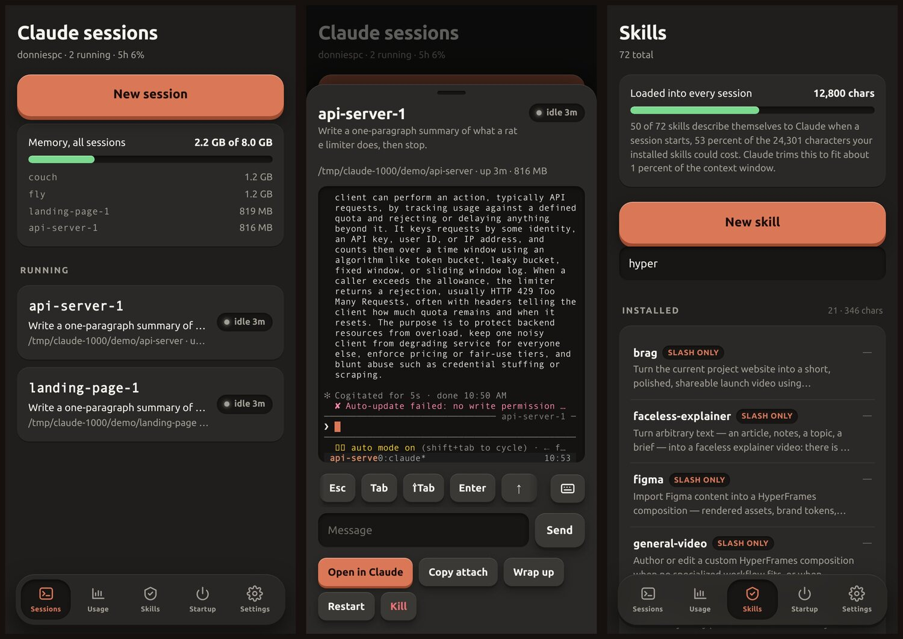

# Claude Manager

A self-hosted control panel for the [Claude Code](https://claude.com/claude-code) sessions running
on your own machine. Start one in any project from your phone, see which ones are waiting on you,
and find out what your installed skills are quietly costing every session you open.



It began as a fix for a daily annoyance: open a terminal app, start a screen session, `cd` to the
project, run `claude`, turn on remote control, repeat for every project, repeat again after every
reboot. It grew the parts that turned out to matter more: knowing when a session needs you, knowing
which conversation is eating your usage window, and knowing that twenty skills you installed for
one video project are describing themselves to Claude in every session you start.

## What makes it different

Session managers for Claude Code exist, and [Codeman](https://github.com/Ark0N/Codeman) is the big
one: many agents, multi-user, Docker isolation, subagent visualisation. If you want mission control
for a fleet, start there. This is a smaller tool with a different centre of gravity.

- **It manages your skills, not just your sessions.** Every skill Claude can see, grouped into
  yours, installed and Anthropic's, with the characters each one costs your context. A four-way
  switch per skill writes Claude Code's own `skillOverrides`. Turning one installed suite to
  slash-only cut 11,501 characters from every session on the machine this was built on, while
  keeping its slash commands working. No other manager I found touches this.
- **It knows when a session needs you, rather than guessing.** Claude Code's own `Notification` and
  `Stop` hooks report it, so "your turn" means Claude actually asked, not that the terminal went
  quiet for a while.
- **It watches the box, not just the agents.** Every session shares one cgroup memory rail. The
  page shows the total, names the fattest session, and a session the kernel kills for memory is
  resumed once, automatically, with a ping.
- **It is one Node file with no dependencies.** No build, no `npm install`, no container. Clone,
  run the installer, done.

## What it does

**Sessions.** One tap starts Claude in any directory, resuming a previous conversation or starting
fresh. Sessions are named `project-1`, `project-2`, and the tmux name, the Remote Control name and
Claude's own session name all match. Each card shows whether Claude is working, waiting for you, or
gone, read from Claude Code's own session registry rather than guessed.

**A real terminal.** The session sheet holds the live tmux pane, with a scrolling strip of the keys
a phone keyboard hides: Esc, Tab, Shift-Tab, arrows, Ctrl-C, and the digits that answer a
permission prompt. Drag to scroll the scrollback. Or open the same conversation in the Claude
mobile app with one tap.

**Survives a reboot.** A startup set you choose comes back at boot, each entry resumed where it
left off or started fresh. No terminal, no typing.

**Watches the box.** A memory meter against the cgroup rail every session shares, so one leaking
session cannot take the machine down quietly. A session killed by the rail is resumed once,
automatically. Idle sessions are offered up for closing.

**New models.** It notices when Anthropic ships one, on the page and in Discord, with the id ready
to paste. Opt-in, six-hourly, and the first run stays quiet about models that already existed.

**Usage.** Output tokens attributed per conversation, so you can see which piece of work is
spending your window. Switch on account limits and it also shows your live 5-hour and 7-day bars.

**Skills.** Every skill Claude can see, grouped into yours, installed, and Anthropic's, with what
each one costs your context in characters. A four-way switch per skill writes Claude Code's own
`skillOverrides`, so you can stop a 20-skill suite advertising itself in every session while
keeping its slash commands. Turning one suite to slash-only cut 11,501 characters from every
session on the machine this was built for.

**Built for a phone.** Quick replies you tap instead of typing, a file picker that drops a photo or
a log straight into the project directory and tells Claude where it landed, and a swipe-dismissed
sheet over a real terminal.

**Worktrees and other engines.** Start a session in a fresh git worktree so it cannot touch the
tree you are working in, or start `codex` or a plain shell in the same directory instead.

**Scriptable.** `cs` drives all of it from a shell, and the bundled skill teaches Claude to use it,
so you can say "start a session in the api repo and tell it to fix the failing test" to a session
you already have open.

## Requirements

Linux with `systemd --user`, `node` 20+, `tmux`, `jq`, `git`, and `claude` on your PATH.
Tested on Ubuntu 24.04. macOS is not supported yet: the memory meter and the process walk read
`/proc`.

## Install

```bash
git clone https://github.com/thenamesdonnie/claude-manager.git
cd claude-manager
./install.sh
```

It installs two `systemd --user` services, links `cl` and `cs` into `~/.local/bin`, downloads
[ttyd](https://github.com/tsl0922/ttyd) for the in-page terminal (skip with `--no-terminal`), and
installs the `claude-manager` skill. Everything lands in your home directory; nothing needs root.
Then open `http://<your-machine>:8795`.

Two things it will tell you about if they are missing:

- `sudo loginctl enable-linger $USER` so sessions survive logout and reboot.
- `set -g mouse on` in `~/.tmux.conf`, which is what lets a phone scroll a pane.

Remove it with `./install.sh --uninstall`. Your running sessions and your data are left alone.

## Security

**This app starts processes and types into them. Anything that can reach its port can run commands
as you.** There is no sandbox, and Claude sessions it starts may be running in a permissive
permission mode.

- Keep it on a trusted network. A LAN name behind a reverse proxy, or a VPN, is the intended shape.
- **Never put it behind a public tunnel or port-forward** without authentication in front of it.
- For anything less than fully trusted, set `"token": "some-long-random-string"` in
  `data/config.json` (or the `CLAUDE_SESSIONS_TOKEN` environment variable). Every request then
  needs it, as `?token=` once per device, an `X-Auth-Token` header, or the cookie the page sets.
- `BIND=127.0.0.1` in the unit restricts it to the machine itself if you would rather reach it
  over SSH forwarding.

Account limits are **off until you turn them on**, in Settings or the Usage tab. When on, the app
reads the Claude Code OAuth token already saved at `~/.claude/.credentials.json` and calls the same
account endpoint Claude Code's own `/usage` uses. It runs as you, on your machine, reading your own
file; the token is sent only to Anthropic and is never stored or logged here. That endpoint is
undocumented, so treat the bars as a convenience that may stop working. Everything else, including
the per-conversation token counts, works without it.

## Running a second instance

Every path and port is overridable, so a test or demo instance can run beside the real one without
touching it:

```bash
DATA_DIR=/tmp/demo TMUX_SOCKET=demo PORT=8796 TERM_PORT=7682 node server.mjs
```

Give it its own ttyd (`TMUX_SOCKET=demo ttyd -p 7682 -i lo -W -a -b /term ~/.local/bin/claude-term-attach`)
or leave the terminal out.

## How it works

```
browser ──► server.mjs (node, no dependencies) ──► tmux -L claude ──► claude --remote-control
                │
                ├── ~/.claude/sessions/*.json     live status, names, Remote Control ids
                ├── ~/.claude/projects/**/*.jsonl conversation titles and token usage
                ├── ~/.claude/settings.json       hooks, per-skill switches
                └── ttyd on 127.0.0.1:7681        the terminal, proxied under /term
```

Sessions live on their own tmux socket (`-L claude`), inside the launcher's systemd cgroup, so the
memory rail covers them and `tmux ls` never shows them by accident. `KillMode=process` means
restarting the launcher leaves every session running.

The installer adds four Claude Code hooks (`Notification`, `Stop`, `UserPromptSubmit`,
`SessionEnd`) pointing at `http://127.0.0.1:8795/api/hook`, which is how the page knows the moment
a session needs you. They are plain HTTP hooks in your `settings.json` and can be removed by hand.

## The `cs` command

```
cs list                       what is running, with status and title
cs dirs                       pinned directories
cs new <name>                 create a project folder, git init, pin it
cs start <dir> [-r last|<id>] [-m "first message"] [-p mode]
cs peek <name> [lines]        what is on its screen
cs send <name> "text"         type a line and press Enter
cs keys <name> Escape         a key: Enter Escape Up Down Tab BTab C-c
cs wrapup <name>              send the wrap-up prompt, close when Claude finishes
cs restart|kill <name>
cs skills [search]            every skill, grouped, with its context cost
cs skill <name> <mode>        on | name-only | user-invocable-only | off
cs usage                      account limits and the heaviest conversations
cs events [n]                 the launcher's log
```

`cs json <cmd>` prints raw JSON for any of them.

## Design notes

`UX.md` is the written spec for how every element behaves and why: the sheet, its swipe dismissal,
the tactile key styling, the terminal's touch scrolling, and the traps each one cost. Worth reading
before changing the front end.

## Prior art

Worth knowing about before you pick one:

- [Codeman](https://github.com/Ark0N/Codeman) — the most developed of these. Nine agent types,
  multi-user, Docker isolation, a respawn controller for day-long autonomous runs.
- [Claude tmux Manager](https://github.com/anonymonstar/Claude_tmux_manager) — FastAPI dashboard
  with AI-written session summaries and per-session cost.
- [claudux](https://github.com/snazzybean/claudux) and
  [claude-session-manager](https://github.com/wolfpeter/claude-session-manager) — the same tmux
  plus browser shape, smaller.

## Licence

MIT. Bundles [xterm.js](https://github.com/xtermjs/xterm.js) (MIT) in `public/vendor`.
Not affiliated with Anthropic.
